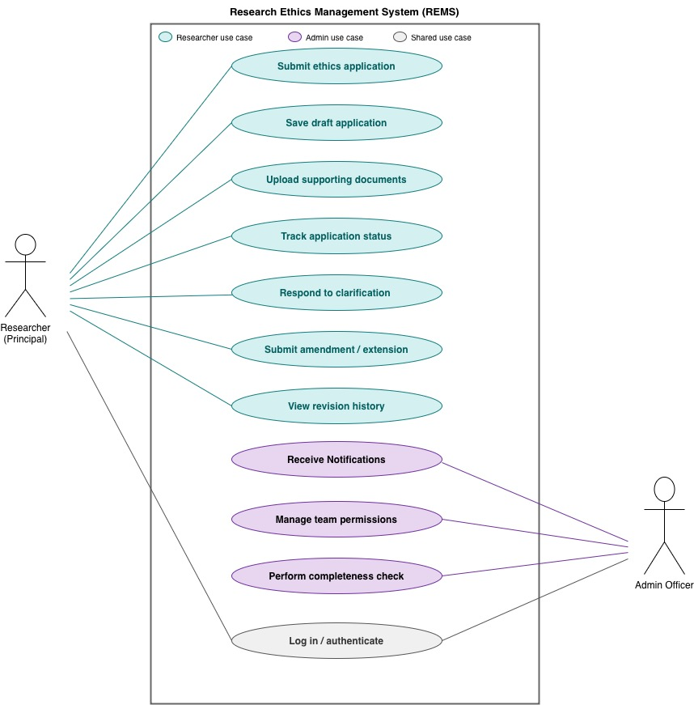

# CITS3301/4401 Software Requirements & Design

##  Project Report (Phase 1) 
## Group Number: 20

## Team Members:

| Name | Student ID | GitHub Username |
|------|----------------|-----------------|
| Peiyu Yu | 23901307 | YUPeiyu123 |
| Xing Wang | 23932778 | estherwangx95 |
| Md Faraz Kabir Khan | 24427672 | farazkabir |
| Robin Varughese  Mathew | 24702715 | robin20516 |
| Bisha Babu Babu | 24741489 | bishababu1506-ops |

---

# 4. Phase 1 Tasks

## 4.1 Project Setup and Team Organisation
### 4.1.1 Team Communication & Responsibilities

#### Communication Methods
The team will primarily communicate through Microsoft Teams, using both video meetings and messaging features. Tasks will be allocated to team members during meetings and confirmed through text messages for clarity and follow-up. 

#### Meeting Frequency & Format
Meetings will be held on an as-needed basis, depending on the progress of the project. The preferred format is online, although face-to-face meetings may be arranged when necessary. A summary of each meeting will be shared in the group chat for reference and continuity.

#### Accountability & Progress Tracking
The project will be hosted on **GitHub**, where progress will be tracked and managed. Clear deadlines will be established, ensuring that each member is accountable for completing their assigned work on time.

### 4.1.2 Version Control Strategy

#### Repository Hosting
The project will be hosted on **GitHub**, using a private repository to manage all files and documentation.

#### Branching Strategy
The team will adopt a **feature-branch workflow**:
- `main` branch → Stable, final version
- Feature branches → Created for each task (e.g., `feature/4.6-use-case`, `feature/4.1-introduction`)

#### Merging Process
- All changes must be submitted via **Pull Requests (PRs)**.
- At least one peer review approval  is required before merging.
- Conflicts must be resolved collaboratively by the team member and reviewer.

#### Version Control Policies
- Small, frequent commits are encouraged for traceability.
- No direct commits to `main` branch are allowed.
- All PRs must include a description of changes and testing notes.

### 4.1.3 Risk Management & Quality Assurance

#### Potential Risks & Mitigation

- **Member unavailability (illness or workload issues):**  
  Tasks will be distributed with overlap where possible to ensure backup support.

- **Missed deadlines:**  
  Weekly progress tracking and task breakdown into smaller milestones will help reduce delays.

- **Communication breakdown:**  
  Regular meetings and centralized communication tools (MS Teams) will reduce miscommunication.

- **Service outage (GitHub or tools unavailable):**  
  Local backups and periodic exports of critical documents will be maintained.

#### Quality Assurance Approach

- All documents and deliverables will undergo peer review before submission.
- A standard template format will be used for documentation to ensure consistency.
- Feedback from reviews will be incorporated before final submission.

## 4.2 Version Control and Effort Tracking

The group uses a private version-controlled repository (e.g., GitHub) to manage all project work. All project documentation is maintained using **Markdown (.md) files only**, ensuring that content remains lightweight, readable, and easy to track through version control.

Using Markdown allows effective collaboration, as changes can be clearly reviewed and attributed to individual team members. It also supports proper change tracking, unlike binary formats such as `.docx` or `.pdf`.

Final reports are generated from Markdown files using `Typora` to produce the submitted PDF deliverable, ensuring consistency in formatting and structure.

The repository itself is not submitted for assessment but may be reviewed upon request to verify contributions and development history.

## 4.3 Stakeholder Identification and User Stories 
### a) Stakeholders:
#### 1. PhD Student Principal Researcher

A PhD student acting as a principal researcher is responsible for preparing and submitting ethics applications for their research projects. They must provide detailed research descriptions, supporting documents, and respond to feedback from reviewers.
They benefit from the system through improved guidance, clear submission requirements, and transparency in tracking application status.

#### 2. Administrative Staff

Administrative staff are responsible for managing incoming applications, checking completeness, and coordinating the review workflow. They also monitor application progress and maintain records.
They benefit from reduced manual tracking (e.g., spreadsheets and emails), improved consistency, and better oversight of application status.

### b) User Stories:
#### PhD Student (Principal Researcher)

1.	As a PhD student (principal researcher), I want to submit an ethics application with all required documents in a single system, so that my research can be reviewed efficiently without missing information.
2.	As a PhD student, I want to receive notifications and track the status of my application, so that I know when to respond to reviewer feedback or provide revisions.
3.  As a PhD student, I want to revise and resubmit my application after receiving feedback, so that I can address reviewers’ concerns and obtain approval.
4.  As a PhD student, I want to upload and manage different versions of supporting documents, so that changes over time are tracked and reviewers can access the correct version.

#### Administrative Staff
5.	As an administrative staff member, I want to verify that an application is complete before assigning it for review, so that reviewers only receive valid submissions.
6.	As an administrative staff member, I want to monitor the progress and status of all applications, so that I can ensure timely processing and identify delays.
7.  As an administrative staff member, I want to assign applications to appropriate committee members, so that each application is reviewed by qualified reviewers.
8.  As an administrative staff member, I want the system to maintain a record of all actions taken on applications, so that there is a clear audit trail for accountability and compliance.

## 4.4 Elicitation Interview 

### a) Supplemental Interview Questions  

In this interview, the term *researcher* is narrowed to specifically refer to **PhD students acting as principal researchers**.  

The project brief identifies researchers broadly (honours, master’s, PhD students, and academic staff), but requires each research activity to have a **principal investigator** responsible for the application and compliance process.  

These questions focus on the needs of PhD students fulfilling this role.

#### 1. Draft Saving and Auto-Save

**Question:**  
Would you like the system to allow you to save an ethics application as a draft and return to complete it later? Would you also expect an auto-save feature while working on long applications?

**Justification:**  
Ethics applications are time-consuming and may not be completed in one session. This question helps determine whether draft saving and auto-save features are needed to improve usability and prevent data loss.

#### 2. Managing Multiple Applications

**Question:**  
If you need to manage an initial ethics application together with later amendments or extensions, what difficulties would you face? Would a dashboard showing status, deadlines, and required actions be helpful?

**Justification:**  
A principal researcher may manage multiple related activities or applications. The current process lacks clear tracking support. This question helps identify the need for dashboards, filtering, and status tracking.

#### 3. Clarity of Application Requirements

**Question:**  
Do you find the current application requirements clear, or do you often feel uncertain about what information is required? Would guidance such as templates, examples, or instructions be helpful?

**Justification:**  
Applicants may be unsure about required information. This question evaluates whether additional guidance (templates, examples, instructions) is needed to improve clarity and reduce errors.

#### 4. Validation Before Submission

**Question:**  
Would you prefer the system to automatically check for missing or incomplete sections before allowing submission?

**Justification:**  
Incomplete applications can delay review. This question determines whether built-in validation is required to improve submission quality.

#### 5. Communication Channels

**Question:**  
For communication related to an ethics application (e.g., clarification requests, revision feedback, decisions), would you expect interactions to occur within REMS, or through external tools such as email or Microsoft Teams?

**Justification:**  
Current communication occurs via email or informal channels. This question clarifies whether REMS should include internal communication or rely on external tools, helping define system scope and traceability.

#### 6. Notifications and Progress Updates

**Question:**  
How would you prefer to receive updates on the progress of your application: email notifications, a status dashboard, or both? Would reminder notifications for deadlines or revision requests be useful?

**Justification:**  
Delays and lack of transparency are key issues. This question identifies preferred methods for progress tracking and deadline awareness.

#### 7. Team Permissions and Collaboration

**Question:**  
If your research involves a supervisor or team members, should they be able to view the application, upload documents, or edit sections? What level of access control would you expect?

**Justification:**  
Ethics applications are collaborative, but access rights are unclear. This question helps determine the need for role-based permissions and collaboration features.

#### 8. Version Comparison and Revision Tracking

**Question:**  
When revisions are requested, would you find it useful to compare previous and revised versions side by side? Would you like changes to be highlighted?

**Justification:**  
Revision processes can be unclear. This question evaluates the need for version comparison and change tracking to support clarity during reviews.

### c) Interview Report

#### Meeting Details

- **Date:** 08 April, 2026
- **Time:** 17:00
- **Venue:** Building 225 (GEOGRAPHY AND GEOLOGY), G09 Seminar Room, UWA Campus 
- **Duration:** 20 Minutes

#### Attendance

##### Interviewers (Group 20 Members)
- Xing Wang (23932778)  
- Md Faraz Kabir Khan (24427672)  
- Bisha Babu (24741489)  
- Peiyu Yu (23901307)  
- Robin Varughese Mathew (24702715)  

##### Interviewee
- **Name:** Karla Ivkovic  
- **Role:** PhD Student acting as Principal Researcher  
- **Stakeholder Category:** Researcher (Principal Investigator)  

#### Summary of the Interview

This interview was conducted as part of the requirements elicitation phase for the REMS project. The interviewee represents a PhD student acting as a principal researcher, a key stakeholder involved in the ethics application and compliance lifecycle.

The interviewee provided clear direction on system usability and collaboration. She strongly supported features like auto-saving, draft management, and a centralized tracking dashboard. To minimize confusion during application building, she requested concrete examples over just standard instructions. The interviewee prefers communication and notifications to be handled through a dual approach using both the REMS platform and standard email. Notably, she prefer a flat access structure for research teammates rather than restrictive role-based permissions, and she prioritized simple access to historical file versions over complex, side-by-side text comparison tools.

####  Responses, Insights, and Requirements Refinements

##### Q1: Draft Saving and Auto-Save

**Response Summary:**  
Both draft saving and auto-save were strongly expected. The interviewee emphasized the importance of preserving progress due to the length and complexity of applications.

**Key Insights:**
- Draft saving is a baseline usability requirement  
- Auto-save is critical to prevent data loss  
- Applications are completed over multiple sessions  

**Requirements Refinements:**
- The system must allow saving applications as drafts at any time  
- The system must implement periodic auto-save without user action   

##### Q2: Managing Multiple Applications

**Response Summary:**  
A dashboard is necessary to manage multiple applications, including amendments and extensions.

**Key Insights:**
- Users often handle multiple applications or stages simultaneously  
- Lack of a centralized view creates confusion and inefficiency  
- Dashboard is a core system component, not optional  

**Requirements Refinements:**
- Provide a dashboard listing all applications (active, pending, historical)  
- Display status, deadlines, required actions, and application type  
- Support filtering and sorting (e.g., by status, date, type)  

##### Q3: Clarity of Application Requirements

**Response Summary:**  
Current requirements are often unclear. Worked examples are particularly helpful.

**Key Insights:**
- Ambiguity is a real usability barrier  
- Generic instructions are insufficient  
- Contextual examples significantly improve understanding  

**Requirements Refinements:**
- Provide contextual guidance for each section/question  
- Include worked examples based on realistic scenarios  
- Deliver guidance inline (e.g., tooltips or expandable help panels)  

##### Q4: Validation Before Submission

**Response Summary:**  
Basic validation is sufficient; complex validation is not mandatory.

**Key Insights:**
- Focus should be on completeness, not content correctness  
- Overly complex validation may hinder usability  

**Requirements Refinements:**
- Validate completion of mandatory fields before submission  
- Provide clear, field-level error messages  
- Allow users to review a summary before final submission  

##### Q5: Communication Channels

**Response Summary:**  
Both in-system communication and email notifications are expected.

**Key Insights:**
- A hybrid communication model is preferred  
- Email should complement, not replace system messaging  
- Communication traceability is important  

**Requirements Refinements:**
- Enable in-system messaging for feedback and decisions  
- Send email notifications for key events (e.g., updates, decisions)  
- Maintain communication history linked to applications  

##### Q6: Notifications and Progress Updates

**Response Summary:**  
The interviewee prefers both dashboard tracking and email notifications, including reminders.

**Key Insights:**
- Users rely on both passive (email) and active (dashboard) updates  

**Requirements Refinements:**
- Send email notifications for status changes  
- Provide real-time updates via dashboard  

##### Q7: Team Permissions and Collaboration

**Response Summary:**  
Team members should have equal access to applications.

**Key Insights:**
- Simplicity is preferred over granular role-based access  
- Flat access model reduces administrative overhead  
- Separation from external reviewers is still necessary  

**Requirements Refinements:**
- Allow principal investigators to add team members  
- Provide equal view/edit access to all team members  
- Restrict submission authority to the principal investigator  
- Maintain distinct access control for external users (e.g., reviewers)  

##### Q8: Version Comparison and Revision Tracking

**Response Summary:**  
Version comparison is not needed, but version history is important.

**Key Insights:**
- Users value access to previous versions  
- Side-by-side comparison may add unnecessary complexity  

**Requirements Refinements:**
- Maintain version history for all applications  
- Allow users to view previous versions at any time  
- Deprioritize comparison/diff features  

####  Summary of Requirements Refinements

| Q# | Topic                  | Key Refinement |
|----|------------------------|----------------|
| 1  | Draft & Auto-Save      | Both required; auto-save is essential |
| 2  | Application Dashboard  | Core feature for managing applications |
| 3  | Application Guidance   | Examples required; inline support |
| 4  | Validation             | Focus on completeness only |
| 5  | Communication          | Hybrid model: system + email |
| 6  | Notifications          | Dashboard + email + reminders |
| 7  | Collaboration          | Flat shared-access model |
| 8  | Version History        | History required; comparison not needed |

## 4.5 Requirements Specification 

For this task, our group chose the subsystem ethics application creation, submission, revision, and tracking for a PhD student acting as the principal researcher. This is a suitable scope because it focuses on one clear part of REMS and matches our chosen stakeholder. This scope was further refined by the interview with our selected stakeholder, which highlighted the need for draft saving, auto-save, guidance examples, basic validation, dashboard and email updates, shared teammate access, and access to older file versions.

The following requirements are written to be clear, testable, consistently structured, and uniquely identified, and each is labelled as either functional or non-functional.

| ID | Type | Requirement |
|---|---|---|
| FR-01 | Functional | The system shall allow a principal researcher to create a new ethics application for a research activity involving human participants. |
| FR-02 | Functional | The system shall require the principal researcher to enter required information before submission, including the project title, research description, methodology, participant risks, and research team details. |
| FR-03 | Functional | The system shall allow the principal researcher to save an incomplete application as a draft and return to it later. |
| FR-04 | Functional | The system shall automatically save the application while the principal researcher is working on it. |
| FR-05 | Functional | The system shall allow the principal researcher to upload supporting documents as part of an ethics application. |
| FR-06 | Functional | The system shall provide examples or guidance to help the principal researcher understand what information is needed in different parts of the application. |
| FR-07 | Functional | The system shall perform basic validation before submission and tell the principal researcher if required fields or sections are missing. |
| FR-08 | Functional | The system shall record the date and time when an application is submitted. |
| FR-09 | Functional | The system shall show the current status of each application to the principal researcher, including draft, submitted, under review, revision requested, approved, conditionally approved, and rejected. |
| FR-10 | Functional | The system shall provide a dashboard so the principal researcher can view multiple applications, amendments, or extensions and check their current status. |
| FR-11 | Functional | The system shall allow the principal researcher to view clarification requests, revision requests, and decisions inside REMS. |
| FR-12 | Functional | The system shall send email notifications to the principal researcher for important updates, including submission confirmation, revision requests, and final decisions. |
| FR-13 | Functional | The system shall allow the principal researcher to edit and resubmit an application when clarification or revision has been requested. |
| FR-14 | Functional | The system shall allow authorised research teammates to access the same application. |
| FR-15 | Functional | The system shall allow authorised research teammates to view, edit, and upload documents to the shared application with the same level of access. |
| FR-16 | Functional | The system shall store previous versions of application files and allow authorised users to open older versions of those files. |
| FR-17 | Functional | The system shall require user authentication before any application can be created, viewed, edited, or submitted. |
| NFR-01 | Non-functional | The system shall present forms, statuses, and guidance in a clear and consistent way so that the principal researcher can understand the process without needing help from administrative staff. |
| NFR-02 | Non-functional | The system shall protect confidentiality by making sure that only authenticated and authorised users can access application information and supporting documents. |
| NFR-03 | Non-functional | The system shall keep an audit trail of important actions, including draft creation, auto-save, submission, revision, resubmission, and status changes. |
| NFR-04 | Non-functional | The system shall support file versioning so that current and previous versions of documents can be clearly identified and accessed. |
| NFR-05 | Non-functional | The system shall send email notifications within a reasonable time after a status change, clarification request, or revision request is recorded in REMS. |

These requirements were based on the REMS scenario and the interview results. Together, they describe a clear subsystem that supports the principal researcher in creating, submitting, revising, and tracking ethics applications. They also include important system constraints such as authentication, confidentiality, versioning, and audit trails.

4.6 Use Case Diagram

a) Use case diagram:

b) Use case description:

Goal: To allow a researcher acting as principal investigator to complete and submit a research ethics application to the REMS for administrative review and subsequent ethics committee evaluation.

Actors:
- Primary Actor: Researcher (PhD student as Principal Investigator)
- Secondary Actor: Admin Officer

Preconditions:
- The researcher is registered and has a valid account in REMS.
- The researcher has logged in successfully.
- The researcher has prepared the necessary information about their research activity, including a description of the methodology, participant details, and any associated risks.
- At least one supporting document (e.g. consent form, information sheet, or risk assessment) is ready for upload.

Postconditions:
- The ethics application is recorded in REMS with a unique application ID.
- The application status is set to "Submitted -Pending Administrative Review."
- The admin officer is notified of the new submission.
- An audit trail entry is created recording the submission timestamp and the identity of the submitting researcher.

Main Success Scenario

1. The researcher navigates to the REMS dashboard and selects "Create New Application."
2. The system displays an application form with sections for research description, methodology, participant information, risk assessment, and supporting documents.
3. The researcher fills in the research title and provides a description of the research activity and its objectives.
4. The researcher enters the methodology, including details of how participants will be recruited, what data will be collected, and how it will be stored.
5. The researcher identifies all team members involved in the research activity and assigns their roles within the application.
6. The researcher uploads all required supporting documents, including consent forms and participant information sheets. The system stores each document with a version number and upload timestamp.
7. The researcher reviews all sections of the application using the system's summary view.
8. The researcher clicks "Submit Application." The system performs an automatic completeness check, verifying that all mandatory fields are filled and at least one supporting document has been uploaded.
9. The system accepts the submission, assigns a unique application ID, and sets the application status to "Submitted - Pending Administrative Review."
10. The system sends an automated notification to the researcher confirming successful submission, and notifies the admin officer of the incoming application.

Alternate Flow 1 - Incomplete Application

At step 8, if the system's completeness check detects one or more mandatory fields that are empty or a required document that has not been uploaded:

1. The system does not submit the application.
2. The system highlights the incomplete sections and displays a summary of what is missing.
3. The researcher corrects the identified issues and returns to step 7.

Alternate Flow 2 - Researcher Saves as Draft

At any point between steps 3 and 7, the researcher may choose to save the application as a draft instead of submitting:

1. The researcher clicks "Save Draft."
2. The system saves all entered data and uploaded documents against the application, assigning it a draft status.
3. The system confirms the save with a timestamp.
4. The researcher may close the application and return to complete it in a later session. The use case resumes from step 2 when the researcher reopens the draft.

Alternate Flow 3 — Session Timeout During Completion

At any point between steps 3 and 8, if the researcher's session expires due to inactivity:

1. The system automatically saves any entered data as a draft before terminating the session.
2. The researcher is redirected to the login page with a message indicating their session has expired and their progress has been saved.
3. Upon logging back in, the researcher is presented with the option to resume the saved draft. The use case resumes from step 2.

Special Requirements (Non-Functional)

- All supporting documents must be stored with version control so that earlier versions remain accessible for audit purposes.
- The application and all associated documents must only be visible to the submitting researcher, their nominated team members, and authorised administrative staff.
- The completeness check at step 8 must complete within 3 seconds of the researcher clicking submit.
- The system must maintain a full audit trail of all actions taken on the application, including saves, edits, and the final submission.
